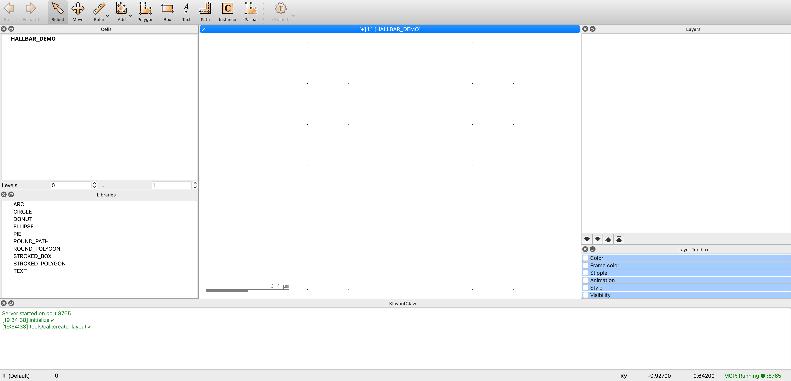

# KlayoutClaw

[](https://www.python.org/downloads/)
[](https://modelcontextprotocol.io/)
[](LICENSE)

MCP server plugin for KLayout — connect your agent harness (Claude Code, Codex, Cline, or any MCP client) to your desktop KLayout. Design layouts in natural language and make batch edits across your GDS files, all through the [Model Context Protocol](https://modelcontextprotocol.io/).

Built for device physicists working on 2D material devices, superconducting qubits, photonics, and other micro/nanofabricated systems.

> **macOS only** for now. Linux/Windows support is planned but untested.



## How It Works

KlayoutClaw runs inside KLayout as an autorun macro. It starts a JSON-RPC 2.0 server on `127.0.0.1:8765` that speaks MCP over HTTP. AI tools connect to this endpoint and can create layouts, run arbitrary pya scripts, and save GDS/OASIS files — all executed on KLayout's main Qt thread with zero external dependencies.

```
┌─────────────┐       HTTP/JSON-RPC        ┌─────────────────┐
│  Claude /    │  ◄──────────────────────►  │  KLayout GUI    │
│  Codex /     │    127.0.0.1:8765/mcp      │  + KlayoutClaw  │
│  Any MCP     │                            │    plugin        │
│  client      │                            │                  │
└─────────────┘                            └─────────────────┘
```

## Quick Start

```bash
# 1. Clone
git clone https://github.com/caidish/KlayoutClaw.git
cd KlayoutClaw

# 2. Install plugin into KLayout
python install.py

# 3. Launch KLayout
open /Applications/klayout.app

# 4. Test the connection
python tests/test_connection.py
```

## MCP Tools

| Tool | Description |
|------|-------------|
| `create_layout` | Create a new layout with a top cell |
| `execute_script` | Run arbitrary Python/pya code in KLayout |
| `save_layout` | Save layout as GDS2 or OASIS |
| `get_layout_info` | Get layout summary (cells, layers, dbu) |
| `screenshot` | Capture viewport as PNG (what the user sees) |
| `auto_route` | **(experimental)** Autoroute connections between pin pairs |

`execute_script` is the power tool — it runs any Python code inside KLayout with access to `pya`, the current layout, and view. The other tools handle lifecycle and visualization. See [docs/tools.md](docs/tools.md) for full parameter schemas.

### Autorouter (experimental)

`auto_route` automatically connects pin pairs using Hungarian matching and cost-based pathfinding. It runs as a subprocess with numpy/scipy/scikit-image, supporting obstacle avoidance and configurable path spacing. Still under active development — contributions welcome.

### Example: Create a rectangle via MCP

```python
import json, urllib.request

def mcp(method, params=None, req_id=1):
    payload = {"jsonrpc": "2.0", "id": req_id, "method": method}
    if params: payload["params"] = params
    req = urllib.request.Request("http://127.0.0.1:8765/mcp",
        data=json.dumps(payload).encode(),
        headers={"Content-Type": "application/json"}, method="POST")
    return json.loads(urllib.request.urlopen(req).read())

# Initialize + create layout
mcp("initialize", {"protocolVersion": "2025-03-26", "capabilities": {},
    "clientInfo": {"name": "example", "version": "0.1"}})
mcp("tools/call", {"name": "create_layout", "arguments": {"name": "TOP"}}, 2)

# Draw a 100x50um rectangle on layer 1/0
mcp("tools/call", {"name": "execute_script", "arguments": {"code": """
dbu = _layout.dbu
li = _layout.layer(1, 0)
_top_cell.shapes(li).insert(pya.Box(int(-50/dbu), int(-25/dbu), int(50/dbu), int(25/dbu)))
result = {"status": "ok", "shape": "rectangle"}
"""}}, 3)

# Save
mcp("tools/call", {"name": "save_layout",
    "arguments": {"filepath": "/tmp/example.gds"}}, 4)
```

## Using with Claude Code

```bash
# Add KlayoutClaw as an MCP server
claude mcp add klayoutclaw --type http --url http://127.0.0.1:8765/mcp

# Or use the config file
claude --mcp-config mcp_config.json
```

Then just ask Claude to create layouts:

> "Create a Hall bar device with a 100x25um graphene channel, 6 side probes, metal contacts, and bonding pads. Save it as hallbar.gds."

## UI Plugin

The UI plugin (`klayoutclaw_ui.lym`) adds a status indicator and command history panel to KLayout — no source modifications needed.

- **Status bar**: Shows `MCP: Running ● :8765` in green when active
- **Dock panel**: Scrollable command history with timestamps and pass/fail indicators

See [docs/ui-plugin.md](docs/ui-plugin.md) for details.

## Skills (Claude Code Plugin)

KlayoutClaw is a Claude Code plugin marketplace. Install it to get skills that Claude can invoke automatically:

```bash
# Add the marketplace
/plugin marketplace add caidish/KlayoutClaw

# Install the plugin
/plugin install klayoutclaw@klayoutclaw
```

Or test locally during development:

```bash
claude --plugin-dir ./path/to/KlayoutClaw
```

### Available Skills

| Skill | Slash Command | Description |
|-------|---------------|-------------|
| `geometry` | `/klayoutclaw:geometry` | Create rectangles, polygons, paths, cells, and instances |
| `display` | `/klayoutclaw:display` | Toggle layer visibility, show/hide layers |
| `visual` | `/klayoutclaw:visual` | Capture layout as PNG for visual inspection |
| `image` | `/klayoutclaw:image` | Load reference images (microscope, SEM) as background overlay |
| `nanodevice:flakedetect` | — | Detect vdW heterostructure material boundaries (hBN, graphene, graphite) from optical microscope images and commit polygons to KLayout |
| `nanodevice:gdsalign` | — | Align GDS templates to microscope images using lithographic marker detection and similarity transforms |
| `nanodevice:routing` | — | Place pads and autoroute connections between device features |

Claude also loads these skills automatically when relevant (e.g., "draw a rectangle" triggers the geometry skill).

See [docs/skills.md](docs/skills.md) for full reference.

### Nanodevice Skills

The nanodevice skills are agent-orchestrated pipelines for semiconductor/2D-material device fabrication workflows:

**flakedetect** — Identifies material boundaries in van der Waals heterostructure stacks from optical microscope images. The pipeline has 5 stages: cross-substrate alignment (SIFT + Chamfer), per-material segmentation (graphite, graphene, top/bottom hBN), coordinate transforms + overlay, polygon commit to KLayout, and visual review.

**gdsalign** — Aligns GDS lithography templates to microscope images. Extracts marker pairs from GDS, template-matches them in the image, computes a similarity transform, and warps contours into GDS coordinates.

## Project Structure

```
KlayoutClaw/
├── .claude-plugin/
│   ├── plugin.json               # Claude Code plugin manifest
│   └── marketplace.json          # Claude Code marketplace catalog
├── plugin/
│   ├── klayoutclaw_server.lym    # MCP server (v0.6)
│   └── klayoutclaw_ui.lym        # UI panel + status bar
├── skills/                       # Claude Code skills (auto-loaded)
│   ├── scripts/mcp_client.py     # Shared MCP client
│   ├── geometry/                 # Shape creation skills
│   ├── display/                  # Layer visibility skills
│   ├── image/                    # Background image overlay skill
│   ├── visual/                   # Layout capture skill
│   └── nanodevice/               # Device fabrication pipelines
│       ├── flakedetect/          # vdW heterostructure detection
│       ├── gdsalign/             # GDS template alignment
│       └── routing/              # Pad placement + autorouting
├── tools/
│   ├── gds_to_image.py           # GDS → PNG converter
│   └── route_worker.py           # Subprocess routing engine
├── tests/
│   ├── test_connection.py        # Protocol-level MCP test
│   ├── test_connection.sh        # E2E connection test
│   ├── test_flakedetect.py       # Flakedetect pipeline tests (29 tests)
│   ├── test_gdsalign.py          # GDS alignment tests (12 tests)
│   ├── create_hallbar.py         # Hall bar creation test
│   ├── evaluate_gds.py           # Structural evaluation
│   └── test_hallbar.sh           # E2E Hall bar test
├── tests_resources/              # Test fixtures
│   └── ml08/                     # Microscope images + Template.gds
├── docs/
│   ├── tools.md                  # MCP tool reference
│   ├── skills.md                 # Skills CLI reference
│   ├── ui-plugin.md              # UI plugin docs
│   └── plans/                    # Architecture design docs
├── install.py                    # KLayout plugin installer
└── mcp_config.json               # Claude Code MCP config
```

## Architecture

- **`pya.QTcpServer`** on Qt main thread — no Python threads, no GIL issues
- **No external dependencies** — only Python stdlib + pya
- **JSON-RPC 2.0** over HTTP (plain JSON, no SSE)
- All pya calls execute on the main thread directly

See [docs/plans/](docs/plans/) for design decisions and the threading problem that led to this architecture.

## Tests

```bash
# Protocol-level connection test (requires KLayout running)
python tests/test_connection.py

# Create a Hall bar and verify structure
python tests/create_hallbar.py /tmp/hallbar.gds
python tests/evaluate_gds.py /tmp/hallbar.gds

# Full E2E (installs plugin, launches KLayout, tests connection)
bash tests/test_connection.sh

# Nanodevice skill tests (41 tests — requires test fixtures in tests_resources/)
pytest tests/test_flakedetect.py tests/test_gdsalign.py -v
```

## Community

Built for the device physics community. Interested in contributing? See [DEVELOPMENT.md](DEVELOPMENT.md) or contact **caidish1234@gmail.com**.

## Acknowledgments

The auto-routing engine (`tools/route_worker.py`) incorporates algorithmic techniques from [Klayout-Router](https://github.com/Legendrexial/Klayout-Router) by **Legendrexial** — including graduated damping cost fields, pin-aware routing with per-pair recovery, and sorted routing order. Klayout-Router is licensed under the MIT License.

## License

MIT
