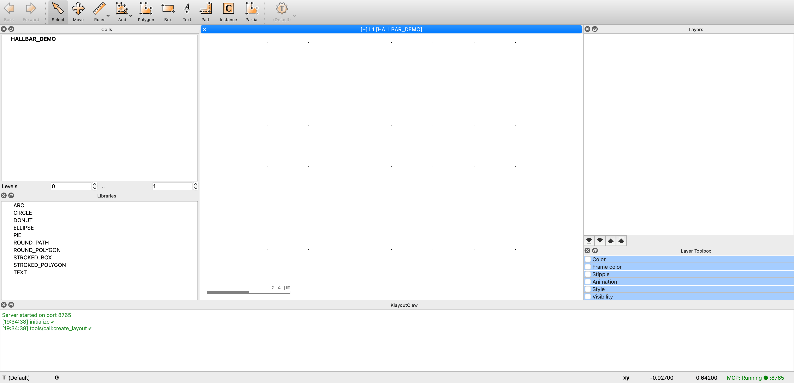

<p align="center">
  
</p>

<h1 align="center">KlayoutClaw</h1>

<p align="center">
  <em>Drive KLayout from any AI agent — chip & nanodevice layout over MCP.</em>
</p>

<p align="center">
  <a href="https://www.python.org/downloads/"></a>
  <a href="https://modelcontextprotocol.io/"></a>
  <a href="LICENSE"></a>
  
</p>

---

KlayoutClaw plugs KLayout into the [Model Context Protocol](https://modelcontextprotocol.io/) so Claude, Codex, Cline, or your own agent can create layouts, run `pya` scripts, autoroute pins, and drive full nanodevice fabrication pipelines — all in your existing KLayout GUI.

> **macOS only** for now. Linux / Windows are on the roadmap.



## Quick Start

```bash
git clone https://github.com/caidish/KlayoutClaw.git
cd KlayoutClaw
python install.py                 # copies plugin into ~/.klayout/pymacros
open /Applications/klayout.app    # KLayout starts the MCP server on :8765
python tests/test_connection.py   # verify
```

Point any MCP client at `http://127.0.0.1:8765/mcp`:

```bash
claude mcp add --transport http klayoutclaw http://127.0.0.1:8765/mcp
```

Then just ask:

> *"Create a Hall bar with a 100×25 µm graphene channel, 6 side probes, and bonding pads. Save as hallbar.gds."*

## What's Inside

| Layer | Purpose |
|-------|---------|
| **MCP Server** (`plugin/`) | KLayout autorun macro. 19 JSON-RPC tools on `127.0.0.1:8765`: layout I/O, `execute_script`, screenshot, autoroute, design evaluation, plus 9 `vc_*` version-control tools. Zero external deps. |
| **Skills** (`skills/`) | Claude Code plugin with 9 skills — geometry, display, visual, image, GDS import, and 4 nanodevice pipelines (flakedetect, gdsalign, routing, e2e design). Loaded automatically. |
| **Qlaybot** (`agent/`) | Standalone TypeScript agent (v0.4.4) built on Pi-Agent SDK. Ink/React TUI, 10 slash commands, planning sandbox, categorized memory with FTS5 + vector search, 3-phase context compaction, JSON-RPC mode. Auto-launches KLayout. |
| **Tools** (`tools/`) | Subprocess helpers: GDS→PNG, ordered-loop routing engine (numpy/scikit-image/klayout), nanodevice DRC + metric evaluator (gdstk/shapely). |

```
  Any MCP client                          KLayout GUI
  (Claude / Codex / Qlaybot / …)          + KlayoutClaw plugin
┌──────────────────┐  HTTP/JSON-RPC   ┌──────────────────┐
│                  │ ◄──────────────► │  pya.QTcpServer  │
│   agent + skills │  :8765/mcp       │  (Qt main thread)│
└──────────────────┘                  └──────────────────┘
```

## End-to-End Demo

An autonomous run of the full vdW heterostructure pipeline — load a GDS template, overlay flake-detection results, generate a Hall bar, route every pin to bonding pads — from a single prompt.

https://github.com/user-attachments/assets/f51d5649-e69b-4885-b17f-f849277a05a6

<sub>Video not rendering? Uncompressed copy at [`docs/Demo.mp4`](docs/Demo.mp4).</sub>

## Qlaybot — Batteries-Included Agent

```bash
cd agent
npm install && npm run build
export ANTHROPIC_API_KEY=...
npm start        # interactive TUI
```

Qlaybot ships its own MCP client and auto-launches KLayout. First run creates `~/.qlaybot/`. After `npm link`, the `qlaybot` command is available globally. See [`agent/README.md`](agent/README.md) for the full CLI, RPC mode, subagents, and 697-test suite.

## Dependencies

The MCP server itself uses only Python stdlib + KLayout's `pya`. Subprocess tools (`auto_route`, `evaluate_design`) and nanodevice skills need a scientific Python stack — we recommend a conda env named `instrMCPdev`:

```bash
conda env create -f environment.yml
conda activate instrMCPdev
```

Equivalent manual install:

```bash
conda create -n instrMCPdev python=3.11 -y && conda activate instrMCPdev
pip install numpy scipy scikit-image scikit-learn opencv-python-headless \
            gdstk shapely matplotlib klayout==0.30.3 pytest
```

Pass `python_path=` to override the env per-call.

### Optional SAM2 refinement

`skills/nanodevice_flakedetect_sam` wraps the normal flake detectors and can generate prompt candidate overlays for SAM2-assisted refinement. The original detector output contract is preserved; if SAM2, PyTorch, or a checkpoint is missing, the wrapper records the failure in its JSON sidecar and falls back to the baseline detector result.

To enable real SAM2 refinement, install PyTorch for your CUDA/MPS/CPU setup, place the SAM2 source checkout at `tools/sam2-main` or set `SAM2_ROOT`, and put the checkpoint at `tools/sam2-main/model/sam2.1_hiera_base_plus.pt`. Model weights are intentionally ignored by git; keep them outside normal commits or use Git LFS if the project decides to version them.

SAM2 device selection defaults to CUDA, then Apple Metal/MPS, then CPU. Use
`--sam-device` or `SAM2_DEVICE` to override it. MPS inference enables PyTorch's
CPU operator fallback automatically for Metal operations that are unavailable.

Download sources:

- SAM2 source: https://github.com/facebookresearch/sam2
- SAM2.1 base-plus checkpoint: https://huggingface.co/facebook/sam2.1-hiera-base-plus/tree/main (`sam2.1_hiera_base_plus.pt`)

## Documentation

- [`docs/tools.md`](docs/tools.md) — MCP tool reference (all 19)
- [`docs/skills.md`](docs/skills.md) — skill catalog
- [`docs/ui-plugin.md`](docs/ui-plugin.md) — UI panel + status bar
- [`docs/plans/`](docs/plans/) — architecture design notes
- [`CONTRIBUTING.md`](CONTRIBUTING.md) — how to help

## Acknowledgments

The auto-routing engine borrows algorithmic techniques from [Klayout-Router](https://github.com/Legendrexial/Klayout-Router) by **Legendrexial** (MIT).

## License

MIT — see [LICENSE](LICENSE). Questions or collaboration: **caidish1234@gmail.com**.
